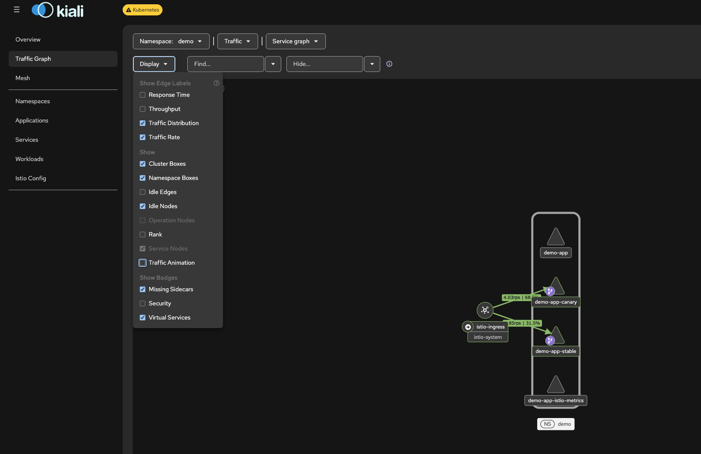
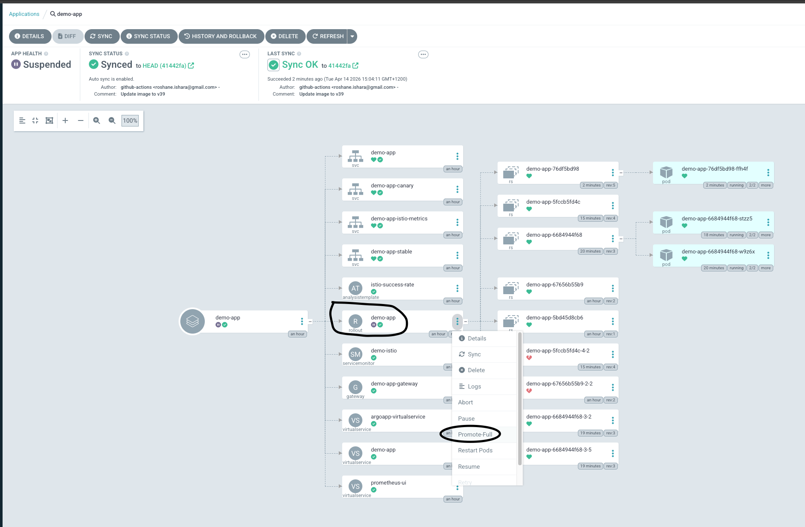

# Argo Canary Demo Helm

---

## Pre-Requisites

- **K8s cluster**
- **Helm and Kubectl configured**
- **ArgoCD deployed**
- **Istio deployed**
- **Prometheus deployed**

---

### 1. K8s Cluster - AKS

```shell
az login
az provider register --namespace Microsoft.OperationalInsights
az provider register --namespace Microsoft.ContainerService
az provider show -n Microsoft.OperationalInsights
az provider show -n Microsoft.ContainerService
az group create --name mario-aks-auckland-meetup-2026-demo-1 --location australiaeast
az aks create --resource-group mario-aks-auckland-meetup-2026-demo-1 --name mario-aks-auckland-demo-1 --node-count 1 --enable-addons monitoring --generate-ssh-keys

az aks list --output table
az aks get-credentials --resource-group mario-aks-auckland-meetup-2026-demo-1 --name mario-aks-auckland-demo-1

kubectl config get-contexts
```

---

### 2. Install Istio Service Mesh

Demonstrate and run through the diagram


```shell
helm repo add istio https://istio-release.storage.googleapis.com/charts
helm repo update
kubectl create namespace istio-system

# Install CRDs
helm install istio-base istio/base  -n istio-system --version=1.29.1

kubectl get crds | grep istio
helm install istiod istio/istiod -n istio-system --version=1.29.1
kubectl get pods -n istio-system | grep -i istiod
helm install istio-ingress istio/gateway -n istio-system --version=1.29.1
kubectl get svc -n istio-system | grep -i ingress

```

---

### 3. Enable Sidecar Injection for Demo Namespace

Demonstrate and run through the diagram

```shell
kubectl create namespace demo
kubectl label namespace demo istio-injection=enabled
kubectl get ns demo --show-labels
kubectl run test --image=nginx -n demo
kubectl get pod test -n demo -o jsonpath='{.spec.initContainers[*].name} {.spec.containers[*].name}'
```


Get Istio Public IP 

```shell
kubectl get svc -n istio-system
```

---

### 4. Install ArgoCD and Argo Rollouts

Demonstrate and run through the diagram

```shell
kubectl create namespace argo-rollouts
kubectl apply -n argo-rollouts -f https://github.com/argoproj/argo-rollouts/releases/latest/download/install.yaml
kubectl get pods -n argo-rollouts
brew install argoproj/tap/kubectl-argo-rollouts
kubectl argo rollouts version

kubectl create namespace argocd
kubectl apply -n argocd -f https://raw.githubusercontent.com/argoproj/argo-cd/stable/manifests/install.yaml
kubectl get pods -n argocd
```

Access ArgoCD

**ArgoCD Login:**
- Username: `admin`
- Password: `<output>`

```shell
kubectl -n argocd get secret argocd-initial-admin-secret -o jsonpath="{.data.password}" | base64 -d
kubectl port-forward svc/argocd-server -n argocd 8080:443
```


---

### 5. Install Prometheus Using Helm Chart

Demonstrate and run through the diagram

```shell
helm repo add prometheus-community https://prometheus-community.github.io/helm-charts
helm repo update
kubectl create namespace monitoring
helm install prometheus prometheus-community/kube-prometheus-stack \
  --namespace monitoring \
  --set grafana.enabled=false \
  --set alertmanager.enabled=false \
  --version 83.4.0 \
  --create-namespace

kubectl get po -n monitoring --watch
```

---

### 6. OPTIONAL: Kiali UI for Traffic Visualization 

```shell 
helm repo add kiali https://kiali.org/helm-charts                                           
helm repo update
helm install kiali-server kiali/kiali-server -n istio-system \
 --set auth.strategy="anonymous" \
 --set external_services.prometheus.url="http://prometheus-kube-prometheus-prometheus.monitoring:9090"

```

---

### 7. The 2 Repo's and Github actions/Pipelines

Demonstrate and run through the 2 diagrams
Github actions workflow diagram

### 8. Helm chart structure

```shell
helm template demo-app ./demo-app > demo-app.yaml
```
--- 

```shell
tree demo-app/templates 
demo-app/templates
├── app-istio-virtualservice.yaml
├── argo-analysis-tpl.yaml
├── argocd-istio-virtualservice.yaml
├── demo-app-istio-metrics-svc.yaml
├── istio-ingressgateway.yaml
├── istio-servicemonitor.yaml
├── prometheus-istio-virtualservice.yaml
├── rollout.yaml
├── service-canary.yaml
├── service-stable.yaml
└── service.yaml
```

---

### 9. Create ArgoCD Application


```yaml
apiVersion: argoproj.io/v1alpha1
kind: Application
metadata:
  name: demo-app
  namespace: argocd
spec:
  project: default
  source:
    repoURL: https://github.com/mri-fernando/argo-canary-demo-helm
    targetRevision: HEAD
    path: demo-app
  destination:
    server: https://kubernetes.default.svc
    namespace: demo
  syncPolicy:
    automated:
      prune: true
      selfHeal: true
  ignoreDifferences:
    - group: networking.istio.io
      kind: VirtualService
      jsonPointers:
        - /spec/http/0/route
```


---

### 10. Apply the YAML (Ideally should be done through CI CD - In this case it's just kubectl apply -f)

```shell
kubectl apply -f argocd/application.yaml
kubectl port-forward svc/argocd-server -n argocd 8080:443
```

Access ArgoCD UI: http://localhost:8080/

---

### 11. Verify Rollout Works

```shell
kubectl get rollouts -n demo
kubectl argo rollouts get rollout demo-app -n demo -w

kubectl get po -n demo
kubectl get rs -n demo
```

---

### 12. OPTIONAL: RollOuts Dashboard

```shell
kubectl argo rollouts dashboard
```

Access RollOuts UI : http://localhost:3100/rollouts/

---

### 13. Troubleshooting

```shell
kubectl logs -n argo-rollouts deploy/argo-rollouts -f
```

---


### 14. Run through the objects created by ArgoCD in the UI 


### 15. Accessing the App

#### Using K8s Service (No Load Balancing)

```shell
kubectl port-forward svc/demo-app -n demo 8081:80
curl -vvv http://localhost:8081
```

#### OPTIONAL: Access Kiali UI 
kubectl -n istio-system port-forward svc/kiali 20001:20001 
http://localhost:20001




#### Get the Public IP

```shell
kubectl -n istio-system get svc istio-ingress
```

#### Update /etc/hosts

```shell

VIM shortcut - :%s/old/new/g

sudo vi /etc/hosts
4.147.48.56 demo-app.mario.com
4.147.48.56 argo-demo.mario.com
4.147.48.56 prometheus.mario.com
```

---

### 16. Access ArgoCD, Prometheus, and App UI

```shell
kubectl get gateway -A -o yaml 
```

- **App:** [http://demo-app.mario.com](http://demo-app.mario.com)
- **ArgoCD:** [https://argo-demo.mario.com](https://argo-demo.mario.com)
- **Prometheus:** [http://prometheus.mario.com/query](http://prometheus.mario.com/query)

---

## Manual Promotion Demo (No Prometheus Analysis)

### Access Prometheus, Load Test / send Traffic, Bump app.py and Rollout a New Version


Simulate Load 
```shell
while True; do curl http://demo-app.mario.com; echo -e "\nrequest sent"; echo -e "\n\n"; done
```

Access Prometheus
http://prometheus.mario.com/query

```promql
sum(rate(istio_requests_total{
  reporter="destination",
  destination_service=~"demo-app-canary.demo.svc.cluster.local",
  destination_workload_namespace="demo",
  response_code!~"5.*"
}[2m]))
/
sum(rate(istio_requests_total{
  reporter="destination",
  destination_service=~"demo-app-canary.demo.svc.cluster.local",
  destination_workload_namespace="demo"
}[2m]))
```


Go through the ReplicaSet, SVC Object and ReplicaSet hash

```shell 
kubectl get rs -n demo
kubectl get svc -n demo demo-app-canary -o yaml | grep -i hash
kubectl get svc -n demo demo-app-stable -o yaml | grep -i hash
```

Manual Promotion by adding "Pause" configuration
Update `values.yaml`:

```yaml
rollout:
  steps:
  - setWeight: 10
  - pause: {}  # Waits for manual promotion
  - setWeight: 50
  - pause: {duration: 30s} #Waits for 30s and proceeds to 100%
```

Bump app.py
```shell
@app.route("/")
def home():
...
...
    return "Hello Auckland k8s Demo - From version 16"
```

Show Github Actions for argo-canary-demo-app repository

Click on Sync on Argo App

**This will return a mix of traffic to both stable and canary:**

```shell
while True; do curl http://demo-app.mario.com; echo -e "\nrequest sent"; echo -e "\n\n"; done
```
### Demonstrate Traffic Splitting using Istio VirtualService and svc objects selectors
```shell
kubectl get svc -n demo  demo-app-stable -o yaml
...
  selector:
    app: demo-app
    rollouts-pod-template-hash: "7876768768"

kubectl get svc -n demo  demo-app-canary -o yaml

kubectl get rs -n demo
NAME                  DESIRED   CURRENT   READY   AGE
demo-app-7876768768   2         2         2       3h13m
demo-app-86ddf7f6d7   0         0         0       5h32m
...
...

```

### Demonstrate how Istio VirtualService is bumped by Argo Rollouts
```shell
kubectl get virtualservice  demo-app -n demo -o yaml

  - name: http
    route:
    - destination:
        host: demo-app-stable
      weight: 90
    - destination:
        host: demo-app-canary
      weight: 10
```

### OPTIONAL: Manually Promote the Canary

* You can use the ArgoCD UI to promote or use the CLI  




```shell
kubectl argo rollouts promote demo-app -n demo
```

#### Check the Istio VirtualService weights 
```shell
kubectl get virtualservice  demo-app -n demo -o yaml

```

#### NOTE: If something goes wrong

```shell
kubectl argo rollouts abort demo-app -n demo
```
---

## Istio Envoy Prometheus Metrics Demo

```shell
kubectl get servicemonitor -n monitoring -o yaml
kubectl get po -n demo

kubectl port-forward po/demo-app-545b8b555b-b44nk -n demo 15090:15090
curl http://localhost:15090/stats/prometheus  | grep -i istio_requests_total
```

---

## Automated Promotion Demo

Make sure to Keep this running in the background:

```shell
while True; do curl http://demo-app.mario.com; echo -e "\nrequest sent"; echo -e "\n\n"; done
```

- Pull changes from remote
```shell
git pull
```

- Bump `values.yaml` in rollout block to 

```shell
rollout:
  steps:
    - setWeight: 10
    - pause: { duration: 30s }
    - analysis:
        templates:
        - templateName: istio-success-rate
        args:
        - name: service-name
          value: demo-app-canary.demo.svc.cluster.local
        - name: namespace
          value: demo
    - setWeight: 50
    - pause: {duration: 30s}
    - analysis:
        templates:
        - templateName: istio-success-rate
        args:
        - name: service-name
          value: demo-app-canary.demo.svc.cluster.local
        - name: namespace
          value: demo

```

- Commit and Push values.yaml 


### Bump app.py and Rollout a New Version

Bump app.py
```shell
@app.route("/")
def home():
...
...
    return "Hello Auckland k8s Demo - From version 16"
```

Send continuous traffic
```shell
while True; do curl http://demo-app.mario.com; echo -e "\nrequest sent"; echo -e "\n\n"; done
```

- Sync ArgoCD application

Verify the virtual service weights

```shell
kubectl get virtualservice  demo-app -n demo -o yaml
kubectl get svc demo-app-canary -n demo -o yaml | grep -i hash 
kubectl get svc demo-app-stable -n demo -o yaml | grep -i hash
kubectl get rs -n demo

```


---

## Automated Rollback Demo - With a Buggy App

- Pull changes from remote
```shell
git pull
```

- Bump `app.py` and commit / push (Github Actions should rollout a buggy version)

```shell
@app.route("/")
def home():
    if random.random() < 0.5:  # 50% chance to fail
        return "simulated failure", 500
    return "Hello Auckland k8s Demo - From version 15"
```

- [Github Actions](https://github.com/mri-fernando/argo-canary-demo-app/actions)
- Sync ArgoCD application (deploys new version)


### Monitor Prometheus UI:

- [http://prometheus.mario.com/](http://prometheus.mario.com/)

Prometheus Query Example:

```promql
sum(rate(istio_requests_total{
  reporter="destination",
  destination_service=~"demo-app-canary.demo.svc.cluster.local",
  destination_workload_namespace="demo",
  response_code!~"5.*"
}[2m]))
/
sum(rate(istio_requests_total{
  reporter="destination",
  destination_service=~"demo-app-canary.demo.svc.cluster.local",
  destination_workload_namespace="demo"
}[2m]))
```


### Monitor the rollout

```shell
kubectl argo rollouts get rollout demo-app -n demo -w
kubectl get virtualservice demo-app -n demo -o yaml
kubectl describe AnalysisTemplate -n demo

kubectl get svc demo-app-canary -n demo -o yaml | grep -i hash 
kubectl get svc demo-app-stable -n demo -o yaml | grep -i hash
kubectl get rs -n demo

```

---

## TODO: Blue-Green Deployment - NEXT Demo

* Bump the values.yaml 

```shell
deploymentStrategy: blue-green
```

* Bump app.py and commit and push

* Keep sending the HTTP traffic and monitor the rollout

* Example output
```shell

kubectl argo rollouts get rollout demo-app -n demo -w


NAME                                  KIND         STATUS        AGE    INFO
⟳ demo-app                            Rollout      ॥ Paused      7h49m  
├──# revision:9                                                         
│  ├──⧉ demo-app-cf4864b8b            ReplicaSet   ✔ Healthy     4m29s  preview
│  │  ├──□ demo-app-cf4864b8b-q7rn7   Pod          ✔ Running     4m29s  ready:1/1
│  │  └──□ demo-app-cf4864b8b-tqlbq   Pod          ✔ Running     4m29s  ready:1/1
│  └──α demo-app-cf4864b8b-9-pre      AnalysisRun  ✔ Successful  4m20s  ✔ 2
├──# revision:8                                                         
│  ├──⧉ demo-app-7cb7bfbd8c           ReplicaSet   ✔ Healthy     40m    stable,active
│  │  ├──□ demo-app-7cb7bfbd8c-2rxm8  Pod          ✔ Running     29m    ready:1/1
│  │  └──□ demo-app-7cb7bfbd8c-ftbc5  Pod          ✔ Running     27m    ready:1/1
│  ├──α demo-app-7cb7bfbd8c-8-2       AnalysisRun  ⚠ Error       36m    ⚠ 5
│  ├──α demo-app-7cb7bfbd8c-8-2.1     AnalysisRun  ✔ Successful  28m    ✔ 2
│  └──α demo-app-7cb7bfbd8c-8-5       AnalysisRun  ✔ Successful  27m    ✔ 2

```

* Note that the VirtualService will remain 100:0 as this is a blue/green style deployment

```shell
kubectl get virtualservice  demo-app -n demo -o yaml 

  http:
  - name: http
    route:
    - destination:
        host: demo-app-stable
      weight: 100
    - destination:
        host: demo-app-canary
      weight: 0
```

* Now Once the Rollout Analysis completes promote it using the ArgoCD UI or CLI 

```shell
kubectl argo rollouts promote demo-app -n demo

```

* Now you should see the new App, access: http://demo-app.mario.com/

---

## NOTES

### Stable app can't override a Buggy App
- An extra ordinary circumstance would be if for some reason a problematic app gets rolled out to production and a stable working app version can't be rolled out due to Prometheus analysis template continously failing due to 0.99% being the success critieria for promotion

- Usually this happens if the failure and count in the analysis template are misconfigured
- To overcome that just bump ```canary.success``` to a lower value, eg: 0.3 and then run:

```shell
kubectl argo rollouts retry rollout demo-app -n demo
```

## Common Questions

- Que: Does rollout CRD support readiness/liveness probes - Ans: Yes, the Argo Rollouts CRD fully supports readiness and liveness probes. You define these probes in the pod template section of the Rollout resource, just like in a standard Kubernetes Deployment

- Que: By default does the traffic sent once the pod is up/running - Analysis runs after pod initialization and readiness probe passes - Ans: The pod must be ready for the analysis template to execute

- Que: Why use Istio as the Ingress for North South Traffic - That's to keep it simple as we don't need to introduce more complexity 

- Que: Why not use Istio subset level (istio destination rules) but use Host level traffic - Ans: With host-level splitting, the VirtualService requires different host values to split among the two destinations. However, using two host values implies the use of different DNS names (one for the canary, the other for the stable). For north-south traffic, which reaches the Service through the Istio Gateway, having multiple DNS names to reach the canary vs. stable pods may not matter. However, for east-west or intra-cluster traffic, it forces microservice-to-microservice communication to choose whether to hit the stable or the canary DNS name, go through the gateway, or add DNS entries for the VirtualServices. In this situation, the DestinationRule subset traffic splitting would be a better option for intra-cluster canarying.

- How the usual PR request goes to release the app (NOTE: In this demo it's directly pushed to main branch)
